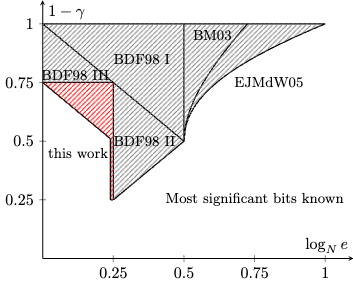

# MSBsOfPrivateKeyAttack

Code for the paper [“Small Public Exponent Brings More: Improved Partial Key Exposure Attacks against RSA"](https://eprint.iacr.org/2024/1329.pdf).

## Introduction

### Our results

Compared to previous results [BDF98], we reduce the number of the leaked bits in $d$ that are needed to mount the attack by $\log_2 (e)$ bits. For $e=65537$, previous work required an additional enumeration of 17 bits to achieve our new bound, resulting in a $2^{10}$ (or 1,024x) increase in time consumption. We also provided a summary of comparison as follows:



### Implementation 

The Python implementation of our new attack is based on [Joachim Vandersmissen's crypto-attacks](https://github.com/jvdsn/crypto-attacks).

## Requirements

- [SageMath](https://www.sagemath.org/) with Python 3.11.1. SageMath 9.8 is recommended.

- [flatter](https://github.com/keeganryan/flatter) (optional, for faster LLL-reduction) If flatter is not installed, you must set **ifFlatter=False**!!!

You can check your SageMath Python version using the following command:

```bash
$ sage -python --version
Python 3.11.1
```
Note: If your SageMath Python version is older than 3.11.1, some features in some scripts might not work.
## Usage

Usage: sage -python `<file>`

For example

```bash
# Run toy exampples.
sage -python toyExampleBDF # Using attack in [BDF98]

sage -python toyExampleBDF # Using our new attack
```

### Debug

You can enable debugging by setting `logging.basicConfig(filename='attack.log', level=logging.DEBUG, format='%(asctime)s - %(levelname)s - %(message)s')` in your code.

### Author

You can find more information on [my personal website](https://www.fffmath.com/).

### License

This script is released under the MIT License. See the [LICENSE](LICENSE) file for details.

[BDF98]: D. Boneh, G. Durfee, and Y. Frankel. Exposing an RSA private key given a small fraction of its bits, 1998. Full version of the work from Asiacrypt’98, available at [Link](http://crypto.stanford.edu/~dabo/abstracts/bits_of_d.html).